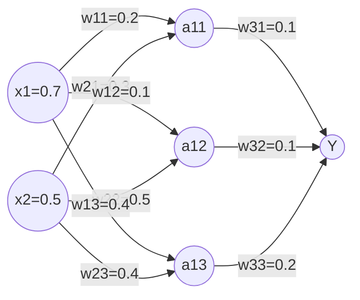
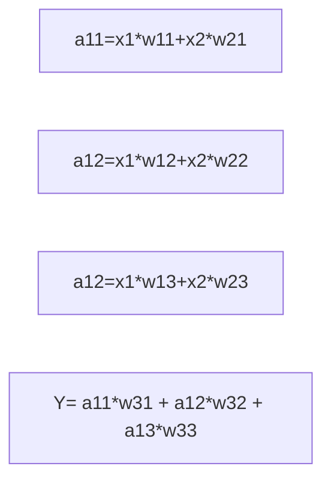

# `mnist实例训练`

## 前向传播

- 前向传播:搭建模型，实现推理（以全连接网络为例)  
eg.生产一批零件将体积x1和重量x2为特征输入NN，通过NN后输出一个数值  

## 前向传播推导  
x是输入为1X2矩阵；w“xy“为待优化的参数  
$$
W1 = 
\left[
\begin{matrix}
	w11&w12&w13 \\
	w21&w22&w23
	\end{matrix}\tag{1}
	\right]
$$

$$
a = 
\left[
\begin{matrix}
 a11 & a12 & a13
\end{matrix}\tag{2}
\right]
$$

其中a为1X3矩阵 = x*W1  
$$
W2 = 
\left[
\begin{matrix}
    w31&w32&w33
    \end{matrix}\tag{3}
    \right]
$$
y = a*W2

a =tf.matmul(x,W1)

y=tf.matmul(a,W2)

- 变量初始化、计算图节点运算都要用会话（with结构）实现  
>with tf.Session() as sess:  
>sess.run  

- 变量初始化：在sess.run函数中用tf.global_variables_initializer()  
>init_op = tf.global_variables_initializer()  
>sess.run(init_op)  

- 计算图节点运算：在sess.run函数中写入待运算的节点  
>sess.run(y)  

- 用tf.placeholder占位，在sess.run函数中用feed_dict喂数据  
>喂一组数据：  
>x = tf.placeholder(tf.float32,shape=(1,2))  
>sess.run(y,feed_dict={x:[[0.5,0.6]]})  

>喂多组数据：  
>x = tf.placeholder(tf.float32,shape=(None,2))  
>sess.run(y,feed_dict={x:[[0.1,0.2],[0.2,0.3]]})  

## 前向传播code
~~~
#coding:utf-8
#两层简单神经网络(全连接)
import tensorflow as tf
#定义输入和参数
x = tf.placeholder(tf.float32,shape=(None,2))
w1 = tf.Variable(tf.random_normal([2,3],stdev=1,seed=1))
w2 = tf.Variable(tf.random_normal([3,1],stdev=1,seed=1))
a = tf.matmul(x,w1)
y = tf.matmul(a,w2)
with tf.Session() as sess:
init_op = tf.global_variables_initializer()
sess.run(init_op)
	print(sess.run(y),feed_dict = {x:[[0.1,0.2],[0.2,0.4]]})
~~~

## 反向传播
反向传播：训练模型参数，在所有参数上使用梯度下降，使NN模型在训练数据上的损失函数最小。  
- 损失函数(loss):预测值(y)与已知答案(z）的差距  
- 均方误差MSE:   
$$
MSE(y,z) = \frac{1}{n}\sum_{i=1}^n(y - z)^2\tag{4}
$$

> loss = tf.reduce_mean(tf.square(y-z))  

- 方向传播训练方法：以减少loss值为优化目标
> train_step = tf.train.GradientDescentOptimizer(learning_rate).minimize(loss)  
> train_step = tf.train.MonmentumOptimizer(learning_rate,momentum).minimize(loss)  
> train_step = tf.train.AdamOptimizer(learning_rate).minimize(loss)  

- 学习率：决定参数每次更新的幅度  

## 反向神经网络实现过程  
- 准备数据集、提前特征、作为输入喂给神经网络  
- 搭建NN结构，从输入到输出(先搭建计算图，再用会话执行)  
>>NN前向传播算法-->计算输出  

- 大量特征数据喂给NN,迭代优化NN参数  
>>NN反向传播算法-->优化参数训练模型

- 使用训练号的模型预测和分类

##反向神经code
~~~python
import tensorflow as tf
import numpy as np

#基于seed产生随机数
seed = 23455
rng = np.random.RandomState(seed)

#随机数返回32行2列的矩阵, 表示32组,体积和重量 作为输入数据集
X = rng.random(32,2)

Y = [[int(x0 + x1 < 1)] for(x0,x1) in range X]

#1.定义神经网络的输入、参数和输出,定义前向传播过程。
x = tf.placeholder(tf.float32,shape = (None,2))
z = tf.placeholder(tf.float32,shape = (None,1))

w1 = tf.Variable(tf.random_normal([2,3],stddev=1, seed = 1 ))
w2 = tf.Variable(tf.random_normal([3,1],stddev=1, seed = 1 ))

a = tf.matmul( x, w1 )
y = tf.matmul( w1, w2 )

#2 定义损失函数及反向传播方法。
loss = tf.reduce_mean(tf.square(y-z))
train_step = tf.train.GradientDescentOptimizer(0.001).minimize(loss)

#生成会话，训练STEPS轮
with tf.Session() as sess:
	init_op = tf.global_variables_initializer()
	sess.run(init_op)
	print("w1:",sess.run(w1))
	print("w2:",sess.run(w2))
	for i in range(3000):
		start = (i*8)%32
		end = start + 8
		sess.run(train_step,feed_dict={x:X[start,end],z:y[start,end]})
		if i % 500 == 0:
			total_loss = sess.run(loss,feed_dict={x:X,z:y})
    print("total_loss:",total_loss)
	print("w1:",sess.run(w1))
	print("w2:",sess.run(w2))	
	
~~~