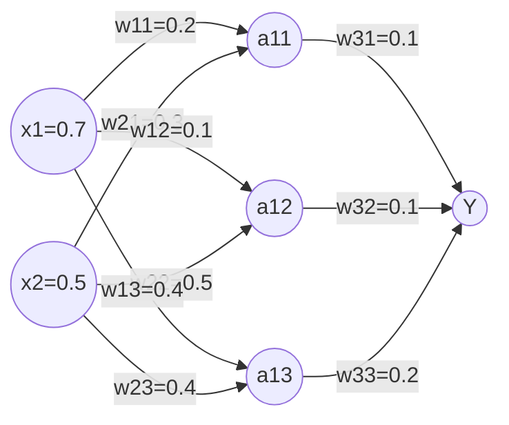
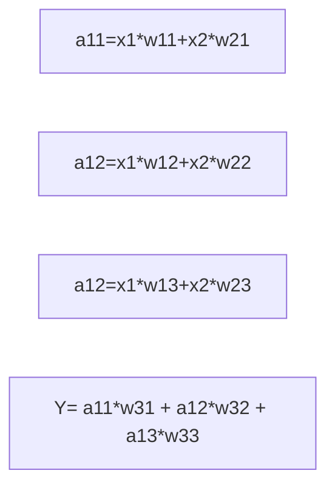

# `mnist实例训练`

## 前向传播

- 前向传播:搭建模型，实现推理（以全连接网络为例)  
eg.生产一批零件将体积x1和重量x2为特征输入NN，通过NN后输出一个数值  

## 前向传播推导  
x是输入为1X2矩阵；w“xy“为待优化的参数  
$$
W1 = 
\left[
\begin{matrix}
	w11&w12&w13 \\
	w21&w22&w23
	\end{matrix}\tag{1}
	\right]
$$

$$
a = 
\left[
\begin{matrix}
 a11 & a12 & a13
\end{matrix}\tag{2}
\right]
$$

其中a为1X3矩阵 = x*W1  
$$
W2 = 
\left[
\begin{matrix}
    w31&w32&w33
    \end{matrix}\tag{3}
    \right]
$$
y = a*W2

a =tf.matmul(x,W1)

y=tf.matmul(a,W2)

- 变量初始化、计算图节点运算都要用会话（with结构）实现  
>with tf.Session() as sess:  
>sess.run  

- 变量初始化：在sess.run函数中用tf.global_variables_initializer()  
>init_op = tf.global_variables_initializer()  
>sess.run(init_op)  

- 计算图节点运算：在sess.run函数中写入待运算的节点  
>sess.run(y)  

- 用tf.placeholder占位，在sess.run函数中用feed_dict喂数据  
>喂一组数据：  
>x = tf.placeholder(tf.float32,shape=(1,2))  
>sess.run(y,feed_dict={x:[[0.5,0.6]]})  

>喂多组数据：  
>x = tf.placeholder(tf.float32,shape=(None,2))  
>sess.run(y,feed_dict={x:[[0.1,0.2],[0.2,0.3]]})  

## 前向传播code
~~~
#coding:utf-8
#两层简单神经网络(全连接)
import tensorflow as tf
#定义输入和参数
x = tf.placeholder(tf.float32,shape=(None,2))
w1 = tf.Variable(tf.random_normal([2,3],stdev=1,seed=1))
w2 = tf.Variable(tf.random_normal([3,1],stdev=1,seed=1))
a = tf.matmul(x,w1)
y = tf.matmul(a,w2)
with tf.Session() as sess:
init_op = tf.global_variables_initializer()
sess.run(init_op)
	print(sess.run(y),feed_dict = {x:[[0.1,0.2],[0.2,0.4]]})
~~~
