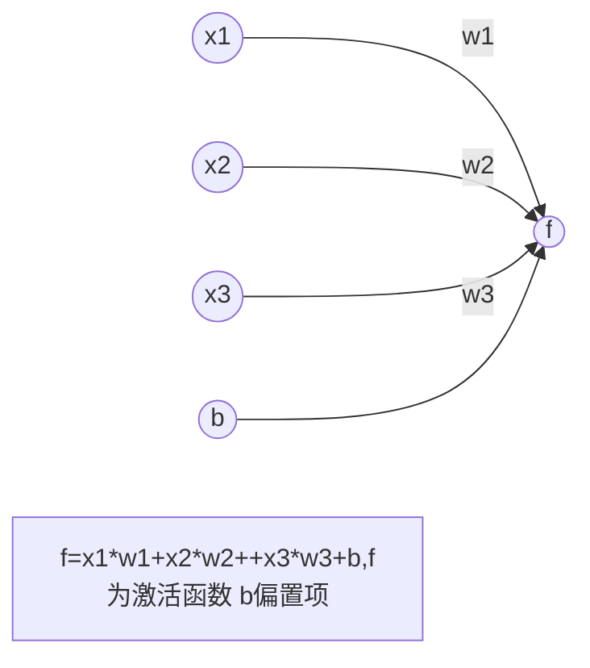
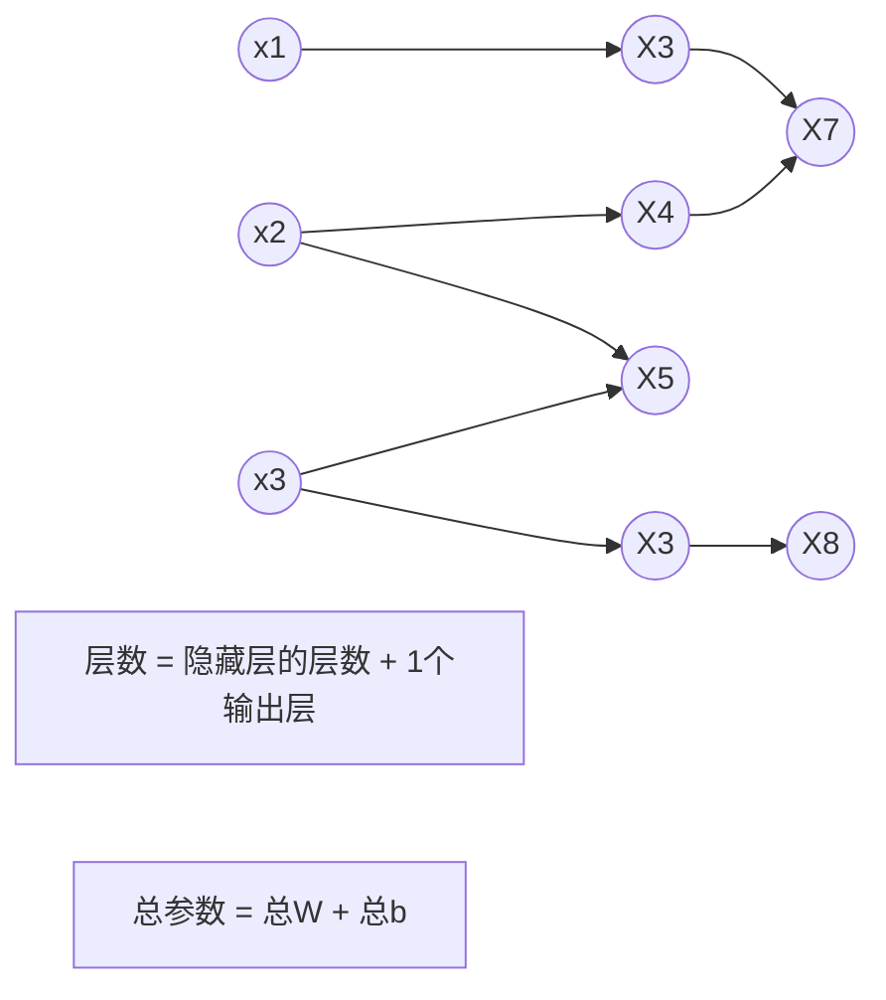

# 损失函数  

## 激活函数  
- relu函数  tf.nn.relu()
$$
f(x) = max(x,0) 
\begin {cases} 
	0,x≤0 \\
	x,x＞0
	\end{cases}\tag{1}
$$

- sigmoid  tf.nn.sigmold()
> $$
> f(x) =\frac{1}{1 + e^{-x}}
> $$

- tanh函数  tf.nn.tanh()

$$
f(x) = \frac{1 - e^{-2x}}{1 + e^{-2x}}
$$

## NN复杂度：多用ＮＮ层数和ＮＮ参数的个数表示

层数 = 2层
总参数 = 3 * 4 + 4 + 4*2  + 2  =26

##  损失函数  
损失函数（ loss）： 用来表示预测值（y y）与已知答案（ y_）的差距。 在训练神经网络时，通过不断改变神经网络中所有参数，使损失函数不断减小，从而训练出更高准确率的神经网络模型  
常用的 损失函数有均方误差、自定义和交叉熵 等  

### 均方差损失函数
均方误差  mse ：n n  个样本的 预测值 y y 与已知 答案  y_之差的 平方和，再求平均值。  
$$
MSE(y_,y) = \sum_{i=1}^n\frac{{(y_ - y)}^2}{n}
$$

在 Tensorflow 中用  loss_mse = tf.reduce_mean(tf.square(y_ - y))  

例如：  
>预测酸奶日销量 y，x1 和 x2 是影响日销量的两个因素。 
>应提前采集的数据有：一段时间内，每日的 x1 因素、x2 因素和销量 y_。采集的数据尽量多.
>在本例中用销量预测产量，最优的产量应该等于销量。由于目前没有数据集，所以拟造了一套数据集。利用 Tensorflow 中函数随机生成 x1、 x2，制造标准答案  y_ =  x1 + x2，为了更真实，求和后还加了正负 0.05 的随机噪声。  
>我们把这套自制的数据集喂入神经网络，构建一个一层的神经网络，拟合预测酸奶日销量的函数。

~~~
#coding:tft-8
#预测多或预测少的影响一样

#0导入模块,生成数据集
import tensorflow as tf
import numpy as np

rdm = np.random.RandomState( 23455 )
X = rdm.rand(32,2)
Y = [[x1+x2 +(rdm.rand()/10.0 - 0.05) ] for (x1,x2) in X]

#1定义神经网络的输入、参数和输出,定义前向传播过程。
x = tf.placeholder(tf.float32, shape=(None,2))
y_ = tf.placeholder(tf.float32, shape=(None,1))
w = tf.Variable(tf.random_normal([2,1]),stddev = 1, seed = 1 )
y = tf.matmul( x, w )

#2定义损失函数及方向传播方法
#定义损失函数为MSE,反向传播方法为梯度下降。
loss_mse = tf.reduce_mean( tf.square( y_ - y ) )
train_step = tf.train.GradientDescentOptimizer(0.001).minimize(loss_mse)

#3生成会话,训练STEPS轮
with tf.Session() as sess:
	init_op = tf.global_variables_initializer()
	sess.run( init_op )
	STEPS = 20000
	BATCH_SIZE = 8
	for i in range( STEPS ):
		start = ( i * BATCH) % 32
		end	  = start + BATCH
		sess.run(train_step,feed_dict={x:X[start:end],y_:Y[start:end]})
		if i % 500 == 0:
			print("w:\n",w)
			
	print("w end:\n",w)
~~~

由上述代码可知，本例中神经网络预测模型为 y = w1*x1 + w2*x2，损失函数采用均方误差。通过损失函数值（loss）不断降低，神经网络模型得到最终参数 w1=0.98，w2=1.02，销量预测结果为 y =0.98*x1 + 1.02*x2。由于在生成数据集时，标准答案为 y = x1 + x2，因此，销量预测结果和标准答案已非常接近，说明该神经网络预测酸奶日销量正确。  

## # 自定义函数
自定义损失函数：根据 问题的实际情况，定制 合理的损失函数 。  
例如：  
>对于预测酸奶日销量问题，如果预测销量大于实际销量则会损失成本；如果预测销量小于实际销量则会损失利润。在实际生活中，往往制造一盒酸奶的成本和销售一盒酸奶的利润是不等价的。因此，需要使用符合该问题的自定义损失函数。  

自定义损失函数为： loss = ∑ 𝑛 𝑓(y_,y)  

其中，损失定义成分段函数：  
$$
f(y_,y) = 
\begin{cases}
	PROFIT *(y_,y)&( y < y_)\\
	COST*(y,y_)&(y >= y_)
	\end{cases}
$$

损失函数表示，若预测结果 y 小于标准答案 y_，损失函数为利润乘以预测结果 y 与标准答案 y_之差；  
若预测结果 y 大于标准答案 y_，损失函数为成本乘以预测结果 y 与标准答案 y_之差。  
用 Tensorflow 函数表示为：  
loss = tf.reduce_sum(tf.where(tf.greater(y,y_),COST(y-y_),PROFIT(y_-y)))  

① 若酸奶成本为 1 元，酸奶销售利润为 9 元，则制造成本小于酸奶利润，因此希望预测的结果 y 多 一些。采用上述的自定义损失函数，训练神经网络模型。  
COST = 1  
PROFIT = 9  

loss = tf.reduce_sum( tf.where(tf.greater(y,y_),(y-y_)*cost),(y_-y)*PROFIT)  

### 交叉熵(Cross Entropy)  
交叉熵(Cross Entropy)： ： 表示 两个概率分布之间的距离。交叉熵越大，两个概率分布 距离 越远， 两个概率分布越 相异 ； 交叉熵越小，两个概率分布 距离 越近 ，两个概率分布越相似。  
交叉熵计算公式： ：𝐇(𝐳_ , 𝐳) = −∑𝐳_ ∗ 𝒍𝒑𝒈 𝒛  
用 用 T Tw ensorflow  函数表示 为  
ce= - - tf.reduce_mean(y_* tf.log(tf.clip_by_value(y, 1e- - 12, 1.0)))  

例如：  
两个神经网络模型解决二分类问题中，已知标准答案为 y_ = (1, 0)，第一个神经网络模型预测结果为y1=(0.6, 0.4)，第二个神经网络模型预测结果为 y2=(0.8, 0.2)，判断哪个神经网络模型预测的结果更接近标准答案。  
根据交叉熵的计算公式得：  
H1((1,0),(0.6,0.4)) = -(1*log0.6 + 0*log0.4) ≈ -(-0.222 + 0) = 0.222  
H2((1,0),(0.8,0.2)) = -(1*log0.8 + 0*log0.2) ≈ -(-0.097 + 0) = 0.097  
由于 0.222>0.097，所以预测结果 y2 与标准答案 y_更接近，y2 预测更准确。   